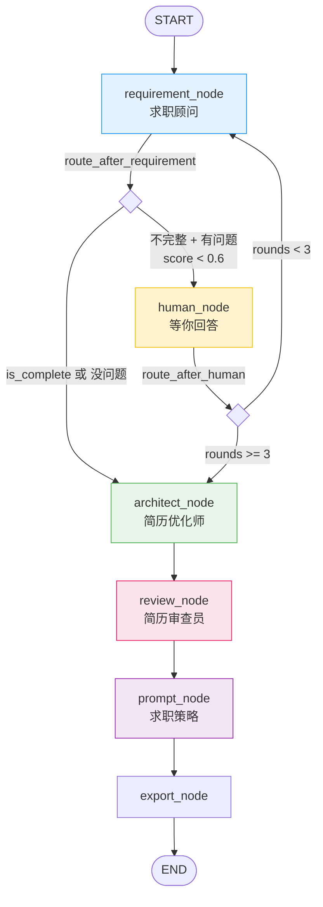

# CareerCraft

> 基于 LangGraph 的多 Agent 协作求职辅导系统。上传简历 + 岗位描述，4 个 Agent 自动完成匹配评分、追问澄清、STAR 优化、审查质检、能力提升建议。

[](https://www.python.org/)
[](https://github.com/langchain-ai/langgraph)
[](LICENSE)

---

## 目录

- [核心思路](#核心思路)
- [架构设计](#架构设计)
- [4 个 Agent 详解](#4-个-agent-详解)
- [Human-in-the-loop](#human-in-the-loop)
- [匹配度公式](#匹配度公式)
- [快速开始](#快速开始)
- [命令行](#命令行)
- [输出文件](#输出文件)
- [评测体系](#评测体系)
- [超时与容错](#超时与容错)
- [设计决策](#设计决策)
- [技术栈](#技术栈)
- [项目结构](#项目结构)

---

## 核心思路

求职场景天然适合多 Agent 协作：一份简历投不同岗位需要不同的优化策略，而候选人往往说不清自己"缺什么"。CareerCraft 把求职辅导拆成 4 个独立的认知任务，每个 Agent 只做一件事：



| 颜色 | 节点 | 调 LLM？ | 说明 |
|------|------|----------|------|
| 🟡 | `human_node` | ❌ | interrupt() 暂停等用户输入 |
| 🔵 | `requirement_node` | ✅ | 匹配评分、追问、多 JD 排名 |
| 🟢 | `architect_node` | ✅ | STAR 重写、量化数据、硬数据保护 |
| 🔴 | `review_node` | ✅ | 真实性/ATS/措辞审查 → 风险提示 |
| 🟣 | `prompt_node` | ✅ | 能力差距分析 P0/P1/P2 |

## 架构设计

### 中央状态：AgentState

所有 Agent 通过一个 `TypedDict` 共享数据，13 个字段分属 4 个阶段。核心原则：**每个字段只有一个写入者**——避免两个节点抢同一个字段的并发冲突。

```
求职顾问阶段              优化阶段          审查阶段       策略阶段
─────────────           ─────────        ────────       ────────
raw_requirement         architecture     review_fb      growth_plan
requirement
questions
missing_info
completeness_score
is_complete
previous_questions      ← 独立字段，human_node 写入，requirement_node 读取
question_rounds
```

### 条件路由

LangGraph 的 `StateGraph` 支持运行时条件分支——不是固定流水线，而是根据 Agent 判断动态决定下一步。当前有 2 个条件路由，其余全是固定边：

- `route_after_requirement` — Agent 觉得信息不够 → 暂停追问；Agent 判完整 → 进优化师
- `route_after_human` — 追问满 3 轮 → 强制推进；未满 → 回分析循环
- `review_node → prompt_node` — 固定边，审查一次即进入策略环节，不循环修正

### 并发处理

`status` 字段使用 `Annotated[str, lambda a, b: b]` 处理并发写入——多个节点同时写 status 时取最后一个值，避免 `InvalidUpdateError`。

---

## 4 个 Agent 详解

### 求职顾问 (`requirement.py`)

**职责：** 接收简历 + 岗位描述，分析匹配度，识别信息缺口，生成追问问题。

**输入：** 简历原文 + JD 文本
**输出：**
- `candidate_profile` — 结构化候选人画像
- `match_score` — 加权公式计算的匹配度（0-1）
- `gaps` — 差距列表（每项含 category、gap、importance）
- `questions` — 追问问题（每轮 1-2 个，20 字以内）
- `is_complete` — 信息是否足够进入优化阶段
- `match_ranking` — 多 JD 排名（单 JD 时为空）

**设计要点：**
- 追问只问"做过没、会不会"，不问"怎么做的"——候选人大段回答体验很差
- 防重复提问：`previous_questions` 独立字段累加历史问题，每轮传给 Agent
- 禁止索要输入文件：简历和 JD 已经在输入中了

### 简历优化师 (`architect.py`)

**职责：** 基于完整画像，按 STAR 法则和量化标准重写简历。

**输入：** 候选人画像 + JD + 差距列表
**输出 5 个模块：**
- `personal_summary` — 个人摘要（X 年经验 + 核心技术 + 行业背景）
- `skills_matrix` — 技能矩阵（精通/熟练/了解三级，JD 关键词优先）
- `work_experience` — 工作经历（每段 2-4 条 STAR 要点，动词开头 + 量化数据）
- `education` — 教育背景（**强制照抄原文**，不改日期、校名、专业）
- `additional_highlights` — 附加亮点（开源、博客、证书）

**硬数据保护（双重防线）：**
1. Prompt 层 — 明确列举姓名、日期、公司名、学校名、电话、邮箱为"绝对禁止修改"，连日期格式都不能变（`2019.9` 不能写成 `2019年9月`）
2. 代码层 — `_validate_hard_data()` 用正则提取原文的日期、学校名、电话、邮箱，对比优化版是否丢失，丢失则打日志告警

### 简历审查员 (`reviewer.py`)

**职责：** 站在面试官角度审查优化后的简历，输出风险提示。

**审查维度：**
1. 真实性 — 量化数据是否可信，面试官深挖能否对答如流
2. ATS 兼容 — 关键词覆盖和格式能否通过机器人筛选
3. 措辞质量 — 是否避免弱动词，每条以强力动作词开头
4. 篇幅控制 — 是否控制在 1-2 页
5. STAR 完整性 — 每条经历是否有行动 + 量化结果

**输出：** `feedback` — 结构化审查反馈文本，包含问题和修改建议（Markdown 格式），直接渲染到报告的风险提示章节。

**不自动修正：** 审查员和优化师都是同一个 LLM——让 LLM 审自己的产出再自己改，本质是"自己批改自己的作业"，可能越改越差。所以只标风险、不自动改，最终决策权在人。

### 求职策略 (`prompt.py`)

**职责：** 对标 JD 差距，生成能力提升建议。

**输出：** `growth_plan` — 按 P0/P1/P2 排列的技能提升计划，含推荐学习资源、预估时间。

---

## Human-in-the-loop

### 实现机制

```python
# human_node 内部
user_response = interrupt({
    "type": "wait_human",
    "questions": ["支付模块你负责哪部分？", "QPS 峰值多少？"],
})
# ↑ 工作流在此冻结，控制权交回 CLI
```

```
requirement_node 生成问题
    ↓
LangGraph interrupt() 抛出异常
    ↓
SqliteSaver 自动保存当前 AgentState → data/checkpoints.db
    ↓
CLI 捕获中断事件，展示问题给用户
    ↓
用户输入回答
    ↓
CLI 通过 Command(resume=...) 恢复工作流
    ↓
human_node 继续执行，interrupt() 返回用户输入
    ↓
requirement_node 重新分析
```

### 控制策略

| 约束 | 值 | 实现 |
|------|-----|------|
| 每轮问题数 | 1-2 个 | Prompt 软约束 |
| 每问字数 | ≤ 20 字 | Prompt 软约束 |
| 最多追问轮数 | 3 轮 | Router 硬截断 |
| 防重复 | `previous_questions` 累加历史问题 | 独立字段持久化 |
| 用户 5 分钟不响应 | 自动跳过 | `ThreadPoolExecutor` + 超时 |

### 断电恢复

两个数据库协同：

| 数据库 | 谁写 | 什么时候写 | 恢复方式 |
|--------|------|-----------|---------|
| `data/checkpoints.db` | SqliteSaver（自动） | 每个 step 后 | `/resume` 从断点接着跑 |
| `data/architect.db` | SessionRepository（手动/流程结束） | `/save` 或流程结束 | `/load <id>` 恢复到任意历史会话 |

同一个 UUID 关联两库——`/load` 取出 session_id → `/resume` 作为 thread_id 在 checkpoints 里定位快照链。

---

## 匹配度公式

```
match_score = 技能 × 0.40 + 经验 × 0.35 + 行业 × 0.15 + 学历软技 × 0.10
              ─────         ─────         ─────         ────────
           每项 0-100 分，LLM 按标准打分，加权计算后除以 100
```

| 子项 | 权重 | 100 分 | 60 分 | 0 分 |
|------|------|--------|-------|------|
| 技能 | 40% | JD 要求的技能全匹配 | 缺 2-3 个核心技能 | 一个核心技能都不对 |
| 经验 | 35% | 年限达标 + 项目高度相关 | 年限差 1-2 年或弱相关 | 年限差 3 年且无关 |
| 行业 | 15% | 同领域经验 | 相关但不完全对口 | 完全跨行 |
| 学历软技 | 10% | 学历达标 + 有团队/管理经验 | 学历达标无软技能 | 学历不达标 |

**设计考虑：** 不包含"量化分"——量化程度影响简历可信度，但不影响"这人适不适合这个岗位"的判断。量化是优化师该做的事，不是评分的标准。

---

## 快速开始

### 1. 安装

```bash
cd ai_agent
pip install -e .
```

### 2. 设置 API Key

```bash
# Windows
set DASHSCOPE_API_KEY=your_key

# macOS / Linux
export DASHSCOPE_API_KEY=your_key
```

默认使用 qwen-plus（阿里云通义千问）。也可在 `.env` 文件中配置其他模型。

### 3. 运行

```bash
# 交互模式
python main.py

# 直接指定简历 + JD
python main.py -r 简历.pdf -j JD.txt

# 多 JD 匹配排名（最多 3 个，超出的提示后截断）
python main.py -r 简历.pdf -j JD1.txt -j JD2.txt -j JD3.txt
```

### 4. 导出

在 CLI 中输入 `/export`，文件输出到 `output/` 目录。

---

## 命令行

| 命令 | 功能 |
|------|------|
| `/new` | 开始新会话（支持 PDF/txt/md 文件路径或粘贴文本） |
| `/status` | 查看当前工作流进度和匹配度 |
| `/export` | 导出生成文档到 output/ |
| `/export <dir>` | 导出到指定目录 |
| `/save` | 保存当前会话状态 |
| `/load` | 列出历史会话 |
| `/load <id>` | 恢复指定会话 |
| `/resume` | 从保存的中断点继续 |
| `/re-jd` | 换一批 JD 重新分析（复用已上传简历） |
| `/help` | 显示帮助 |
| `/exit` | 退出 |

---

## 输出文件

```
output/
├── resume.md          # 优化后的简历（Markdown，5 模块）
├── growth_plan.md     # 能力差距分析与提升建议（P0/P1/P2）
├── full_report.md     # 完整报告（含匹配排名 + 风险提示）
└── resume.pdf         # 简历 PDF（支持中文字体）
```

---

## 评测体系

基于 LLM 生成的 20 组简历-JD 配对数据集，对求职顾问 Agent 的匹配度评分进行量化评估：

| 指标 | 数值 |
|------|------|
| 严格准确率 | 80%（16/20） |
| 宽松准确率（边界值不计错） | 85%（17/20） |
| 高匹配识别率 | 100%（8/8） |
| 平均单次耗时 | 11.8s |

**边界值：** 0.55-0.65 区间人和 LLM 都分不清，硬性归类不合理——在此区间的误判不算错。

**评分保守倾向：** Agent 被设计为 Human-in-the-loop 场景下的保守评分（宁可低估多追问，不愿高估漏信息），评测中调整评分阈值至 0.6 以匹配此倾向。

运行评测：

```bash
python tests/test_eval.py
```

---

## 超时与容错

| 场景 | 机制 | 值 |
|------|------|-----|
| LLM 单次请求超时 | ChatOpenAI `request_timeout` | 120s |
| LLM 失败重试 | ChatOpenAI `max_retries` | 2 次 |
| 用户追问不响应 | `ThreadPoolExecutor` 超时 | 5 分钟自动跳过 |
| 断电/崩溃 | SqliteSaver 每步存 | 回来 `/resume` 继续 |

---

## 设计决策

| 决策 | 选择 | 理由 |
|------|------|------|
| Agent 拆分粒度 | 4 个 | 每个只处理一种认知任务，Reviewer 兜底 |
| 审查不自动修正 | 只标风险 | LLM 审自己产出 ≈ 自己批改作业 |
| 追问轮数 | 3 轮 | 经验值，第 4 轮用户放弃率飙升 |
| 防重复提问 | `previous_questions` 独立字段 | 不跟 `requirement` 搅在一起 |
| 两个计数器分离 | question_rounds | 一个变量承载两种语义必炸 |
| 状态每字段单写者 | 13 字段各自一个源头 | 避免并发冲突 |
| 不存在"完整报告"字段 | 导出时拼 | 数据各自存，展示层集中拼 |
| 无 RAG/向量化 | 全文本直传 | 简历+JD < 5000 字，占上下文 < 5% |
| 硬数据防篡改 | Prompt 软约束 + Regex 硬校验 | 双重防线，丢失告警 |

---

## 技术栈

| 层 | 技术 |
|----|------|
| Agent 编排 | LangGraph（StateGraph + Conditional Edges + SqliteSaver） |
| LLM 调用 | LangChain（ChatOpenAI 兼容 qwen / OpenAI / Claude） |
| 结构化输出 | Pydantic v2 + `with_structured_output()` |
| 正则化评分 | 4 维加权公式（非 LLM 直觉） |
| CLI | Typer + Rich（交互式 REPL + 彩色输出 + 进度提示） |
| 持久化 | SQLite × 2（checkpoints.db + architect.db） |
| 导出 | Jinja2 模板 + fpdf2（Markdown + PDF 双格式） |
| 简历解析 | pdfplumber（支持中文 PDF） |
| 评测 | 20 样本数据集 + 边界值容差 |
| 代码质量 | Ruff + Black + MyPy + Pytest（9 个单元测试） |

---

## 项目结构

```
ai_agent/
├── main.py                  # 入口
├── pyproject.toml            # 项目配置 + 依赖
├── README.md
│
├── app/
│   ├── agents/               # Agent 层（Prompt + Pydantic 模型 + LLM 调用）
│   │   ├── requirement.py    #   求职顾问 — 匹配评分 + 追问
│   │   ├── architect.py      #   简历优化师 — STAR 重写
│   │   ├── reviewer.py       #   简历审查员 — 风险提示
│   │   └── prompt.py         #   求职策略 — 能力提升
│   │
│   ├── graph/                # LangGraph 工作流层
│   │   ├── state.py          #   AgentState — 13 字段中央状态
│   │   ├── nodes.py          #   节点函数 — 每个 Agent 怎么被调用
│   │   ├── router.py         #   条件路由 — route_after_requirement / route_after_human
│   │   └── workflow.py       #   图编译 — create_workflow()
│   │
│   ├── cli/                  # 命令行交互层
│   │   ├── app.py            #   Typer REPL + 工作流驱动
│   │   └── handlers.py       #   命令处理器（/new /save /load...）
│   │
│   ├── exporter/             # 导出层
│   │   ├── markdown.py       #   Jinja2 模板渲染
│   │   └── pdf.py            #   fpdf2 PDF 生成（中文字体）
│   │
│   ├── storage/              # 持久化层
│   │   ├── models.py         #   SQLAlchemy ORM
│   │   └── repository.py     #   SessionRepository
│   │
│   ├── config/               # 配置
│   │   ├── settings.py       #   Pydantic Settings
│   │   └── llm.py            #   LLM 工厂（含超时 + 重试）
│   │
│   ├── utils/                # 工具
│   │   └── __init__.py       #   PDF 解析 + 文件读取
│   │
│   └── templates/            # Jinja2 模板
│       ├── resume.md.j2
│       ├── growth_plan.md.j2
│       └── full_report.md.j2
│
├── tests/
│   ├── test_workflow.py      # 工作流 + 路由 + 导出单元测试（9 个）
│   ├── test_eval.py          # 匹配度评测脚本
│   ├── eval_cases.json       # 评测数据集（20 组）
│   └── conftest.py           # 共享 fixtures
│
└── data/                     # 运行时生成（已 gitignore）
    ├── checkpoints.db        #   LangGraph SqliteSaver
    └── architect.db          #   Session 快照
```
